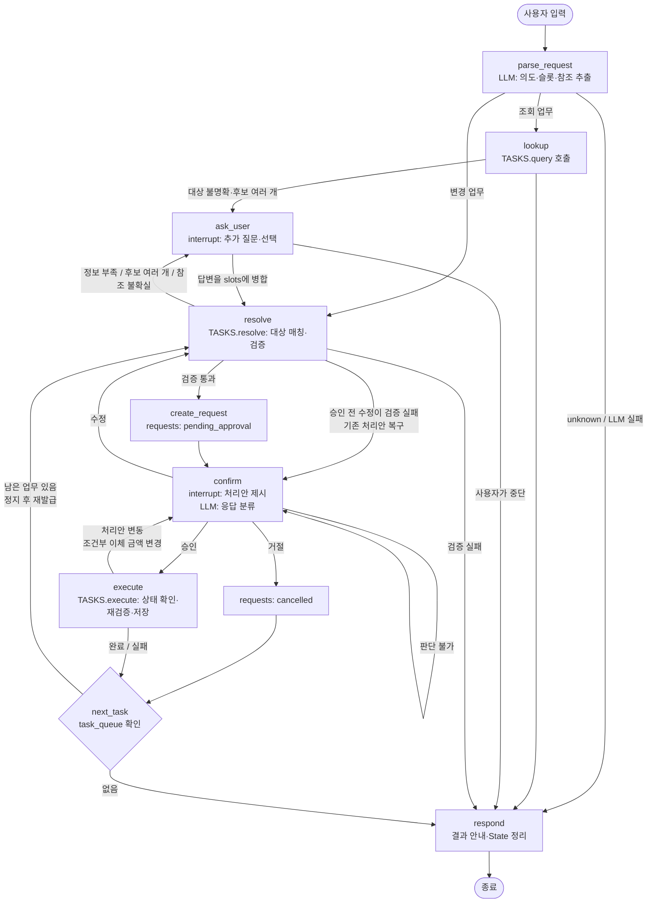

# 설계 초안 (v0.9) — 가상 금융 업무 에이전트

> 전체 업무(계좌·이체, 카드, 청구서·납부, 공통 대화·처리)를 하나의 뼈대로 설계한다.
> 구현은 9절의 단계 순서로 진행하며, 단계마다 이 문서를 갱신한다.

## 1. 설계 원칙

| 원칙 | 내용 |
|---|---|
| LLM은 해석만, 변경은 Python이 | LLM은 사용자 문장을 구조화(의도·슬롯 추출, 승인 응답 분류)하고 응답 문장을 만든다. 대상 매칭, 검증, 데이터 변경은 모두 Python 함수가 담당한다. |
| 승인은 전용 노드에서 | `interrupt()`는 Tool 내부가 아닌 별도 `confirm` 노드에 둔다. |
| 공통 노드 + 업무 레지스트리 | 그래프 노드는 업무와 무관한 공통 단계(해석·검증·질문·승인·실행·안내)로만 구성한다. 업무별 차이는 `TASKS` 레지스트리에 등록한 Python 함수로 처리한다. 업무를 추가해도 그래프 구조는 바뀌지 않는다. |
| 실행 직전 재검증 | 승인까지 시간이 지나면 잔액·상태가 바뀔 수 있으므로, 실행 직전에 다시 검증한다. |
| 현재 사용자 고정 | 별명은 소유자끼리 겹치므로(`생활비`: user-001·user-002) 모든 조회는 `user_id`로 먼저 걸러낸다. `user-001`로 고정한다. |
| 모든 변경 요청은 기록 | 승인 대기로 들어가는 순간 `requests`에 기록하고 상태를 갱신한다. 후속 조회와 재시작 복구의 근거가 된다. |
| 업무 데이터의 기준은 JSON | 대화 진행 상태는 SQLite 체크포인트에, 업무 결과는 JSON에 저장한다. 둘이 어긋나면 **JSON의 `requests` 상태를 기준**으로 판단한다. |

## 2. 전체 흐름도



노드는 9개(`parse_request`, `lookup`, `resolve`, `ask_user`, `create_request`, `confirm`, `execute`, `next_task`, `respond`)이다. 모든 업무가 이 노드를 공유한다.

## 3. 업무 레지스트리

```python
TASKS = {
    "transfer": Task(kind="change", resolve=resolve_transfer, describe=describe_transfer, execute=execute_transfer),
    "query_accounts": Task(kind="query", query=query_accounts),
    ...
}
```

| 영역 | intent | 종류 | 필수 슬롯 |
|---|---|---|---|
| 계좌 | `query_accounts` | 조회 | — (목록·잔액·합계를 함께 반환) |
| 계좌 | `query_transactions` | 조회 | 선택: 계좌, 기간, 금액 범위, 유형 |
| 계좌 | `transfer` | 변경 | 출금 계좌, 입금 계좌, 금액 |
| 계좌 | `conditional_transfer` | 변경 | 출금 계좌, 입금 계좌, 남길 금액 |
| 계좌 | `multi_transfer` | 변경 | 출금 계좌, (입금 계좌, 금액) 목록 |
| 계좌 | `rename_account` | 변경 | 대상 계좌, 새 별명 |
| 카드 | `query_cards` | 조회 | — |
| 카드 | `report_lost` | 변경 | 대상 카드 |
| 카드 | `lock_card` | 변경 | 대상 카드 |
| 카드 | `unlock_card` | 변경 | 대상 카드 |
| 카드 | `reissue_card` | 변경 | 대상 카드, 배송지(집·회사) |
| 카드 | `lost_and_reissue` | 복합 | `report_lost` → `reissue_card` 두 업무를 `task_queue`에 넣음 |
| 카드 | `query_reissue` | 조회 | 선택: 대상 신청 |
| 카드 | `modify_reissue` | 변경 | 대상 신청, 새 배송지 |
| 카드 | `cancel_reissue` | 변경 | 대상 신청 |
| 청구서 | `query_bills` | 조회 | — |
| 청구서 | `pay_bill` | 변경 | 출금 계좌, 청구서 |
| 청구서 | `pay_bills_batch` | 변경 | 출금 계좌, 청구서 목록(또는 "전부") |
| 공통 | `query_request_status` | 조회 | 선택: 업무 종류 힌트 |
| 공통 | `unknown` | — | — |

## 4. LLM 출력 스키마

라우팅은 LLM structured output만 사용한다. LLM에는 **오늘 날짜**, **현재 사용자의 계좌·카드·청구서 이름 목록**, **최근 대화에서 다룬 대상(`last_targets`)**을 함께 전달한다.

```python
class TransferItem(BaseModel):
    to_account: str
    amount: int

class ParsedRequest(BaseModel):
    intent: Literal[...]                       # 3절의 intent 목록
    # 계좌·이체
    from_account: str | None
    to_account: str | None
    amount: int | None                         # '10만 원' → 100000
    keep_amount: int | None                    # 조건부 이체의 남길 금액
    transfers: list[TransferItem] | None       # 여러 계좌 이체
    account: str | None                        # 별명 변경·거래 조회 대상
    new_nickname: str | None
    # 거래 조회
    period: Literal["this_month", "this_week", "last_month", "custom", "all"] | None
    start_date: str | None                     # custom일 때만 YYYY-MM-DD
    end_date: str | None
    min_amount: int | None
    max_amount: int | None
    tx_type: Literal["deposit", "withdrawal", "card_payment"] | None
    # 카드·재발급
    card: str | None
    address_label: Literal["집", "회사"] | None
    application_ref: str | None
    # 청구서
    bills: list[str] | None
    all_bills: bool = False
    # 대화 참조
    refers_to_previous: bool = False           # "그 카드", "아까 이체"처럼 이전 대상을 가리킴
    reason: str

class ApprovalReply(BaseModel):
    decision: Literal["approve", "reject", "modify", "unclear"]
    changes: ParsedRequest | None              # modify일 때 바뀐 슬롯만
```

- LLM은 이름 **문자열**만 추출한다. ID로 바꾸는 일은 Python이 한다.
- 상대 날짜는 LLM이 `period` 값으로만 분류하고, 실제 날짜 범위는 Python이 `today`로 계산한다(LLM 날짜 계산 오류 방지).
- 음수·0 금액도 그대로 추출하고, 거부 여부는 Python 검증에서 판단한다.
- LLM 호출이나 파싱에 실패하면 요청 해석은 `unknown`, 승인 응답은 `unclear`로 처리한다. 데이터는 변경하지 않는다.

## 5. State

```python
class BankState(TypedDict, total=False):
    messages: Annotated[list, add_messages]  # 대화 기록
    user_id: str                  # 현재 사용자 (user-001 고정)
    today: str                    # 기준일 YYYY-MM-DD
    intent: str                   # 현재 업무의 intent
    slots: dict                   # LLM이 추출한 값 (별명·금액, 후보를 고르면 *_id)
    slots_backup: dict | None     # 승인 전 수정 직전의 slots (수정이 실패하면 복구)
    draft: dict                   # slots를 ID로 해석한 처리안
    step: str | None              # 직전 노드의 결과 (ok | ask | fail | cancel | revert), 분기에 사용
    question: str | None          # 추가 질문 문장
    notice: str | None            # 승인 질문 앞에 덧붙일 안내 (수정 실패, 판단 불가)
    missing: list[str]            # 부족한 슬롯 이름
    candidates: list[dict]        # 선택이 필요한 후보 (계좌·카드·신청·요청)
    plan: str | None              # 사용자에게 보여준 처리안 문장
    error: str | None             # 검증·실행 실패 사유
    request_id: str | None        # 현재 처리 중인 requests 항목 ID
    decision: str | None          # approve | reject | modify | unclear
    result: dict | None           # 조회 결과 또는 실행 결과
    task_queue: list[dict]        # 이어서 처리할 업무 (정지 후 재발급)
    last_targets: dict            # 최근 다룬 대상 {account, card, bill, application, request}
```

| 필드 | 설정·변경 시점 | 초기화 시점 |
|---|---|---|
| `messages` | 모든 입력·응답마다 추가 | 유지(SQLite에 영속) |
| `user_id` | 세션 시작 시 | — |
| `today` | 새 요청 시작 시 `datetime.now(KST)` | 새 요청 시작 시 |
| `intent` | `parse_request`, `next_task` | 업무 종료 시 |
| `draft` | `parse_request` 슬롯 → `resolve`에서 ID로 해석, `ask_user`·수정 후 병합 | 업무 종료 시 |
| `missing`, `candidates` | `resolve`, `lookup` | 다시 검증할 때 |
| `plan` | `create_request`, 처리안 변동 시 `execute` | 업무 종료 시 |
| `error` | `resolve`, `execute` | 새 요청 시작 시 |
| `request_id` | `create_request` | 업무 종료 시 |
| `decision` | `confirm` 재개 시 | `confirm` 진입 시 |
| `result` | `lookup`, `execute` | 새 요청 시작 시 |
| `task_queue` | `parse_request`(복합 업무 분해) | `next_task`에서 하나씩 꺼냄 |
| `last_targets` | `lookup`·`execute`가 대상을 다룬 뒤 | 유지(세션 전체) |

## 6. 분기 조건

### 6-1. 공통 분기

| 위치 | 조건 | 다음 |
|---|---|---|
| `parse_request` | 조회 intent | `lookup` |
| | 변경·복합 intent | `resolve` (복합이면 `task_queue`에 나머지를 넣음) |
| | `unknown` / LLM 실패 | `respond` (지원 범위 안내) |
| `resolve` | 필수 슬롯 없음 | `ask_user` |
| | 이름에 맞는 대상이 여러 개 | `ask_user` (후보 선택) |
| | `refers_to_previous`인데 `last_targets`에 해당 대상이 없거나 여러 개 | `ask_user` (대상 확인) |
| | 업무별 검증 실패 | `respond` (사유 안내) |
| | 통과 | `create_request` → `confirm` |
| `confirm` | approve | `execute` |
| | reject | `requests: cancelled` → `next_task` |
| | modify | 슬롯 병합 → `resolve` → 처리안 **전체** 재제시 |
| | unclear | 같은 질문 반복 |
| `execute` | `requests`가 `pending_approval`이 아님 | 실행 안 함 (중복 방지) |
| | 처리안 변동 (조건부 이체) | `plan` 갱신 → `confirm` 재승인 |
| | 성공 / 실패 | `requests` 상태 갱신 → `next_task` |
| `next_task` | `task_queue`가 비어 있지 않음 | 다음 업무 꺼내 `resolve` |
| | 비어 있음 | `respond` |

### 6-2. 계좌·이체

| 업무 | 검증 (순서대로, 먼저 걸리면 실패) | 실행·저장 |
|---|---|---|
| 계좌 조회 | — | 계좌 목록, 계좌별 잔액, 합계 |
| 거래 내역 조회 | 계좌 이름이 있으면 매칭 / `custom` 기간은 시작일 ≤ 종료일 | 기간(시작·종료일 포함, 미지정 시 전체) → 금액 → 유형 필터, 최근순. "이번 주"는 월~일, "결제"는 `card_id`가 있는 출금이며 카드 이름을 함께 표시 |
| 즉시이체 | 계좌 존재 → 금액 > 0 → 출금 ≠ 입금 → 잔액 ≥ 금액 | 잔액 2건 + 거래 2건 + 요청 상태를 한 번에 저장 |
| 조건부 이체 | 계좌 존재 → 남길 금액 ≥ 0 정수 → 이체액(잔액 − 남길 금액) > 0 → 출금 ≠ 입금 | 실행 직전 이체액을 다시 계산한다. **달라졌으면** 새 금액으로 `confirm`에 돌아가 재승인받는다. 0 이하가 되면 실패 처리하고 재요청을 안내한다. |
| 여러 계좌 이체 | 계좌 존재 → 각 금액 > 0 → 입금 계좌 중복 없음, 출금 계좌와 다름 → 잔액 ≥ 총액 | 처리안에 계좌별 금액과 총액을 표시한다. **전체를 한 번에 저장**하며, 실패하면 아무것도 반영하지 않는다. |
| 계좌 별명 변경 | 계좌 존재 → 앞뒤 공백 제거 후 1~20자 → 현재 별명과 다름 → 내 다른 계좌와 중복 없음 | `nickname` 변경 |

### 6-3. 카드

카드 상태: `active`(사용 가능), `locked`(일시 잠금), `lost`(분실 정지)

| 업무 | 허용 상태 → 결과 | 거부 사유 |
|---|---|---|
| 카드 조회 | 이름·ID·종류(신용·체크)·상태 | — |
| 분실 정지 | `active`·`locked` → `lost` | 이미 `lost` |
| 일시 잠금 | `active` → `locked` | `locked`: 이미 잠김 / `lost`: 분실 정지 카드 |
| 잠금 해제 | `locked` → `active` | `active`: 잠겨 있지 않음 / `lost`: **분실 정지는 해제 불가**, 재발급 안내 |
| 재발급 신청 | `lost` 카드만 가능 → 신청 `received` 생성. 카드는 `lost` 유지 | `lost`가 아님 / 같은 카드에 취소되지 않은 신청이 있으면 **기존 신청을 안내** / 배송지가 없으면 `ask_user` |
| 재발급 조회 | 신청이 1건이면 바로 안내, 여러 건이면 `ask_user`로 선택 | 신청이 없으면 기록 없음을 안내 |
| 재발급 수정·취소 | 신청 `received`만 가능 → 배송지 변경 / `cancelled` | `in_production`·`shipping`: 제작이 시작돼 불가 / 이미 `cancelled` / 같은 배송지로 변경 |
| 정지 후 재발급 | `task_queue = [report_lost, reissue_card]`, **각각 승인** | 재발급이 거절·실패해도 **완료된 정지는 되돌리지 않음**. 정지를 거절하면 재발급은 진행하지 않음(큐 비움) |

재발급 신청 상태: `received`(접수) → `in_production`(제작 중) → `shipping`(배송 중) → `delivered`, 또는 `received` → `cancelled`.
제작 중·배송 중 상태는 테스트 데이터로만 준비한다.

### 6-4. 청구서·납부

청구서 상태: `unpaid` → `paid`

| 업무 | 검증 | 실행·저장 |
|---|---|---|
| 미납 조회 | — | `unpaid` 목록과 합계, 납기일순 |
| 청구서 납부 | 계좌 존재 → 청구서 존재 → `unpaid`(이미 납부했으면 거부) → 잔액 ≥ 금액. 기한이 지나도 연체료 없이 가능 | 잔액 + 출금 거래(`merchant`=청구서 이름) + 청구서 `paid` + 요청 상태를 한 번에 저장 |
| 일괄 납부 | 계좌 존재 → 선택한 청구서 중 `unpaid`가 1건 이상. 처리안에 목록과 총액 표시 (총액 > 잔액이어도 승인은 받을 수 있음. 부족한 건은 실행 중에 미납으로 남김) | 납기일이 빠른 순서로 **건별 저장**. 잔액이 부족한 건은 `실패`로 두고 다음 건으로 진행. 저장에 실패하면 해당 건은 미반영, **남은 건은 `미처리`로 두고 중단**. 이미 저장된 납부는 유지. 결과는 완료·실패·미처리로 나눠 안내 |

### 6-5. 공통 대화·처리

| 기능 | 처리 방식 |
|---|---|
| 승인·거절, 자연어 승인·취소 | `confirm`에서 `ApprovalReply`로 분류 (6-1) |
| 승인 전 수정 | `modify` → `resolve`에서 재검증 → 처리안 전체 재제시. 기존 `request_id`의 `params` 갱신 |
| 추가 질문 | `ask_user`로 빠진 슬롯이나 후보를 질문하고, 답변을 `parse_request`로 해석해 `draft`에 병합 |
| 불완전·실행 불가 요청 | 필수 슬롯이 없으면 추가 질문, 검증에 실패하면 사유와 다시 요청할 방법을 안내 |
| 후속 결과 조회 | `query_request_status`: `requests`를 최신순으로 보고 업무 종류 힌트("이체")로 거른다. 1건이면 상태와 내용 안내, 여러 건이면 선택받고, 없으면 기록 없음을 안내 |
| 대화 대상 확인 | `refers_to_previous`이면 `last_targets`에서 대상을 찾는다. 대상이 없거나 여러 개이면 `ask_user`로 확인. 결정된 대상은 처리안에 이름과 ID로 표시 |
| 변경 결과 조회 | 모든 조회는 매번 JSON을 새로 읽어 저장된 현재 값으로 안내 |
| 재시작·장애 복구 | 7절 |

## 7. 재시작·복구

체크포인터는 `SqliteSaver`(`langgraph-checkpoint-sqlite`), 파일은 `data/checkpoints.sqlite`. `thread_id`는 사용자 단위(`user-001`)로 고정한다.

`main.py` 시작 시 `graph.get_state(config)`로 중단된 업무를 확인한다.

| 재시작 시 상태 | 판단 기준 | 처리 |
|---|---|---|
| 중단 없음 | `state.next`가 비어 있음 | 일반 입력 대기 |
| 추가 질문 대기 | `ask_user` interrupt | 질문을 다시 보여준다. |
| 승인 대기 | `confirm` interrupt + `requests`가 `pending_approval` | 재검증 후 처리안을 다시 보여주고 **새로 승인받는다.** |
| 승인 후 실행 중 중단 | `state.next == ("execute",)` | JSON의 `requests`가 `completed`이면 완료로 안내. `pending_approval`이면 **자동 실행하지 않고** 재검증 후 재승인 |
| 일괄 납부 중단 | `requests.result.items`에 일부만 기록됨 | 저장된 건은 완료로 안내하고, 남은 건은 새 요청으로 다시 승인받는다. |
| 복합 업무 중단 | `task_queue`가 남아 있음 | 완료된 단계를 안내하고, 남은 단계는 다시 승인받는다. |

> 재시작 후에는 어떤 경우에도 새 승인 없이 변경을 실행하지 않는다.

## 8. 데이터 설계

### `requests`

```json
{
  "request_id": "req-001",
  "owner_id": "user-001",
  "type": "transfer",
  "params": {"from_account_id": "acc-001", "to_account_id": "acc-002", "amount": 100000},
  "status": "pending_approval",
  "parent_request_id": null,
  "created_at": "2026-09-28T10:00:00+09:00",
  "updated_at": "2026-09-28T10:00:05+09:00",
  "result": {"message": "이체 완료", "transaction_ids": ["tx-021", "tx-022"]}
}
```

- `status`: `pending_approval` → `completed` | `cancelled` | `failed` (일괄 납부는 일부만 완료되면 `partial`)
- `parent_request_id`: 정지 후 재발급처럼 묶인 업무를 연결한다.
- 일괄 납부의 `result.items`: `[{"bill_id": "bill-005", "status": "completed" | "failed" | "unprocessed", "reason": "..."}]`

### `reissue_applications`

```json
{
  "application_id": "rei-001",
  "owner_id": "user-001",
  "card_id": "card-001",
  "address_id": "addr-home",
  "status": "received",
  "request_id": "req-003",
  "created_at": "...",
  "updated_at": "..."
}
```

### 추가·변경 필드

| 대상 | 필드 | 내용 |
|---|---|---|
| `cards.status` | `locked`, `lost` 추가 | 6-3 |
| `bills` | `status: paid`, `paid_at`, `paid_account_id`, `transaction_id` | 납부 기록 |
| `transactions` (이체) | `merchant` = 이체 당시 상대 계좌 별명, `card_id` = `null` | 별명이 바뀌어도 과거 표시 유지. 결제 조회는 `card_id`로 구분하므로 섞이지 않음 |
| `transactions` (납부) | `merchant` = 청구서 이름, `card_id` = `null` | |

### 테스트 데이터

`initial_data.json`(원본)은 수정하지 않는다. 제작 중·배송 중 신청을 확인하려고 `data/test_seed.json`을 따로 두고, 초기화할 때 선택해서 합친다. 예를 들어 `card-002`를 `lost`로 두고 `in_production` 신청 1건을 넣는다.

### 기준일

실제 오늘 날짜(`Asia/Seoul`)를 쓴다. 초기 거래가 2026년 8~9월에 있어서, 실행 시점이 멀어지면 "이번 달" 조회가 비어 보일 수 있다.

### 저장 방식 (`data_store.py`)

- 시작 시 `bank_data.json`이 없으면 `initial_data.json`을 복사한다.
- 저장은 임시 파일에 쓴 뒤 `os.replace`로 교체한다. 저장 중에 실패해도 기존 파일이 깨지지 않는다.
- 한 업무의 변경(잔액·거래·상태·요청 기록)은 **한 번의 저장**으로 반영한다. 일괄 납부만 건별로 저장한다.
- 초기화할 때는 `bank_data.json`과 `checkpoints.sqlite`를 **함께** 지운다.
- 저장 실패 테스트를 위해 `data_store`에 실패 주입 스위치(예: 환경변수 `FAIL_SAVE_AT=2`)를 둔다.

## 9. 구현 단계

| 단계 | 범위 | 확인할 분기 |
|---|---|---|
| 1 | `data_store`, 계좌 조회, 즉시이체, 그래프 뼈대(9개 노드), SQLite | 조회·추가 질문·승인·거절·수정·검증 실패 |
| 2 | 카드 조회·정지·잠금·해제 | 상태 전이 거부 |
| 3 | 재발급 신청·조회·수정·취소, 정지 후 재발급 | `task_queue`, 각 단계 승인, 제작 중 수정 불가 |
| 4 | 청구서 조회·납부·일괄 납부 | 건별 저장, 잔액 부족 건 건너뛰기, 저장 실패 중단 |
| 5 | 거래 내역 조회, 조건부·여러 계좌 이체, 별명 변경 | 기간 계산, 금액 변동 재승인, 전체 일괄 저장 |
| 6 | 후속 결과 조회, 대화 대상 확인, 재시작 복구 점검 | `last_targets`, 7절 시나리오 |

## 10. 변경 이력

| 버전 | 변경 내용 | 이유 |
|---|---|---|
| v0.1 | 최초 초안 (계좌 조회 + 즉시이체) | — |
| v0.2 | 라우터를 LLM structured output 단독으로 확정 | 다양한 자연어 표현을 규칙으로 다 덮기 어려움. 검증은 Python이 맡아 안전성 확보 |
| v0.2 | 이체 거래 `merchant`에 상대 계좌 별명 기록 | 거래 내역에서 이체 상대 확인 |
| v0.2 | 기준일을 실제 오늘 날짜로, `today` 필드 추가 | 실제 앱처럼 동작 |
| v0.2 | `SqliteSaver`와 재시작·복구 규칙 추가 | 재시작 복구 요구사항 |
| v0.2 | 실행 시 요청 상태 확인, 요청 상태 동시 저장 | SQLite와 JSON이 어긋나도 중복 실행 방지 |
| v0.3 | 전체 업무(카드·청구서·공통) 설계로 확장 | 전체 흐름이 하나의 뼈대로 연결되는지 먼저 확인 |
| v0.3 | 업무별 노드 대신 공통 노드 9개 + `TASKS` 레지스트리 구조로 변경 | 업무가 20개 가까이 되면 업무별 노드로는 그래프가 커지고 승인 흐름이 중복됨 |
| v0.3 | `task_queue`, `next_task` 추가 | 정지 후 재발급처럼 각각 승인받는 복합 업무 처리 |
| v0.3 | `last_targets`, `refers_to_previous` 추가 | "그 카드" 같은 대화 대상 확인 |
| v0.3 | `execute → confirm` 경로 추가 | 조건부 이체의 금액이 실행 직전에 바뀌면 재승인 |
| v0.3 | 상대 날짜를 LLM이 `period`로만 분류하고 Python이 계산 | LLM 날짜 계산 오류 방지 |
| v0.3 | 테스트 시드 파일과 저장 실패 주입 스위치 추가 | 제작 중 수정 불가, 저장 실패 시나리오 재현 |
| v0.4 | `ask_user` 다음 노드를 `parse_request`에서 `resolve`로 변경. 답변은 `SlotAnswer` 스키마로 해석해 기존 값에 병합 | `parse_request`로 돌아가면 새 요청으로 처리되어 앞서 받은 값이 초기화됨 |
| v0.4 | `ask_user`에서 사용자가 중단하면 `respond`로 종료 | "그냥 됐어" 같은 답에서 같은 질문이 반복되지 않게 함 |
| v0.4 | 승인 전 수정이 검증에 실패하면 `slots_backup`으로 복구하고 `confirm`으로 돌아감 | 잘못된 수정("1억으로") 때문에 진행 중인 요청 전체가 실패하지 않게 함 |
| v0.4 | `slots`(추출 값)와 `draft`(ID로 해석한 값)를 분리하고 `step`, `question`, `notice` 필드 추가 | 수정·후보 선택 시 원래 표현을 유지하고, 분기 조건을 필드 하나로 판단 |
| v0.4 | 결과 안내는 LLM 대신 템플릿 문장으로 생성 | 금액·잔액을 틀리게 말할 위험을 없애고 테스트를 쉽게 함 |
| v0.4 | 계좌 별명 비교 시 공백·'계좌/통장' 무시, 부분 일치는 후보로 확인 | "여행자금", "여행" 같은 표현 처리. 확신할 수 없는 대상은 다시 확인 |
| v0.4 | Tool 호출 대신 그래프 노드가 `TASKS`를 직접 호출 | 실행 순서(검증 → 승인 → 실행)를 그래프가 보장하도록 함 |
| v0.5 | LLM 스키마를 공통 `Slots` 모델에서 상속하고, 업무별로 쓰는 슬롯은 `Task.slots`에 선언 | 업무를 추가할 때 그래프 노드 코드를 고치지 않고 스키마 필드와 레지스트리만 추가 |
| v0.5 | 후보 선택 형식을 `{"id", "label"}`로 통일 (`SlotAnswer.selected_id`) | 계좌·카드·재발급 신청 등 대상 종류와 관계없이 같은 `ask_user` 노드 사용 |
| v0.5 | 카드 분실 정지·잠금·해제는 `CARD_ACTIONS` 표(허용 상태 → 바뀔 상태, 거부 사유) 하나로 구현 | 세 업무는 상태 전이만 달라 같은 검증·실행 코드를 공유 |
| v0.5 | 카드 조회는 이름이 일부만 맞아도 되묻지 않고 해당 카드를 모두 보여줌 | 조회는 데이터를 바꾸지 않으므로 확인 질문 없이 결과를 보여주는 편이 자연스러움 |
| v0.5 | 카드는 카드 ID로도 지정 가능, 카드 이름 비교 시 공백·'카드' 접미사 무시 | "생활비", "생활비카드", "card-001" 모두 같은 카드로 인식 |
| v0.6 | 정지 후 재발급에서 카드가 이미 분실 정지면 정지 단계를 건너뛰고 재발급 진행 (`resolve` 결과의 `already` → `next_task`) | 사용자의 목적은 재발급이므로, 이미 정지된 카드 때문에 전체 요청이 실패하지 않게 함 |
| v0.6 | 앞 단계를 거절하거나 실행에 실패하면 남은 단계를 진행하지 않았다고 안내 (`_stop_queue`) | 재발급은 분실 정지된 카드만 가능하므로 앞 단계 없이 진행할 수 없음 |
| v0.6 | 복합 업무의 단계별 결과를 `log`에 쌓고, 다음 질문 앞에 앞 단계 결과를 먼저 보여줌 (`log_shown`) | 정지 결과를 모른 채 배송지 질문을 받지 않도록 함. 재시작 후에도 완료된 단계를 다시 안내 |
| v0.6 | 요청 기록에 `parent_request_id`로 앞 단계 요청 연결, 앞 단계에서 확정한 대상 ID를 다음 단계에 전달 | 복합 업무 추적, 후보에서 고른 카드를 재발급 단계에서 다시 묻지 않음 |
| v0.6 | 조회 업무도 대상이 불명확하면 `ask_user`로 선택받음 (`lookup → ask_user → lookup`) | 재발급 신청이 여러 건일 때 명세대로 목록에서 선택 |
| v0.6 | 재발급 수정·취소 후보에서는 취소된 신청 제외, 조회에서는 포함. 후보는 신청일 최신순 | 취소된 신청은 수정·취소 대상이 될 수 없음 |
| v0.6 | 배송지 슬롯은 LLM 스키마에서 `집`/`회사`로 제한 | 등록된 배송지 라벨과 바로 대응 |
| v0.6 | 테스트 시드 `data/test_seed.json` (여행 카드: 제작 중, 교통 카드: 배송 중·취소 이력)과 `초기화 테스트` 명령 추가 | 원본을 바꾸지 않고 수정·취소 제한 상태를 재현 |
| v0.7 | 일괄 납부는 건별 저장 시 요청의 진행 기록(`result.items`)을 함께 저장하고, 요청 상태는 끝날 때 갱신 | 도중에 종료돼도 어디까지 납부했는지 남음. 재시작하면 요청이 `pending_approval`이므로 재검증에서 이미 낸 청구서가 빠지고 남은 건만 다시 승인받음 |
| v0.7 | 일괄 납부 재실행 시 이전 완료 건을 결과에 합침 | 재승인 후에도 전체 결과(완료·실패·미처리)를 한 번에 안내 |
| v0.7 | 일괄 납부 결과를 완료 / 실패(미납 유지) / 미처리(미납 유지)로 표시, 요청 상태는 전부 완료 `completed`, 일부 `partial`, 없음 `failed` | 잔액 부족 건이 미납으로 남는다는 것을 결과에서 바로 알 수 있게 함 |
| v0.7 | 청구서 이름이 부분 일치하는 후보가 1건이면 바로 사용 (여러 건이면 한 건 납부는 선택, 일괄 납부는 실패 안내) | 처리안에 청구서 이름·금액이 표시되어 승인 단계에서 확인됨 |
| v0.7 | 한 건 납부에서 출금 계좌를 물을 때 계좌별 잔액을 함께 보여줌 | 잔액을 보고 계좌를 고를 수 있게 함 |
| v0.7 | 기한이 지난 청구서는 납기일에 '기한 지남·연체료 없음' 표시 | 기한이 지나도 연체료 없이 납부 가능하다는 명세를 안내 |
| v0.8 | LLM 스키마에서 판단 필드(`intent`, `decision`, `cancel`)를 슬롯보다 앞에 배치 | 슬롯이 늘어난 뒤 판단 필드가 뒤에 있으면 슬롯을 모두 null로 채우는 응답이 30회 중 5회 발생, 앞으로 옮긴 뒤 0회 |
| v0.8 | 거래 기간 종류에 `today`, `last_week`, `last_month` 추가. 날짜 범위는 `period_range`가 계산 | 자주 쓰는 상대 기간을 LLM 날짜 계산 없이 처리 |
| v0.8 | '출금'은 카드 결제를 포함한 모든 출금, '결제'는 `card_id`가 있는 출금으로 구분 | 명세의 "결제는 카드를 사용해 지출한 거래" 정의 반영 |
| v0.8 | 조건부 이체의 실행 결과에 `changed` 상태를 추가하고 `execute → confirm` 경로로 재승인 | 설계 2절의 "처리안 변동 시 재승인"을 구현. 요청 기록의 금액도 새 값으로 갱신 |
| v0.8 | 즉시·조건부·여러 계좌 이체가 잔액·거래 반영 함수 `_apply_transfer`를 공유 | 이체 거래 기록 방식을 한 곳에서 관리 |
| v0.8 | 여러 계좌 이체의 입금 계좌는 이름이 하나로 맞으면 사용, 없거나 여러 개면 실패 안내 | 목록 중 한 항목만 되묻는 대화가 복잡해짐. 처리안에 모든 계좌 이름이 표시되어 승인 단계에서 확인 가능 |
| v0.8 | 계좌 별명 중복은 내 계좌끼리만, 공백을 무시하고 비교 | 계좌 매칭이 공백을 무시하므로 '여행자금'과 '여행 자금'이 공존하면 구분할 수 없음 |
| v0.9 | `refers_to_previous: bool` 대신 `referenced_slot`(가리키는 슬롯 이름)으로 변경. 지시어 대상의 이름은 LLM이 추측하지 않음 | "그 계좌로 보내줘"처럼 어느 슬롯을 가리키는지 알아야 채울 수 있음. 이름 추측은 확인 없이 잘못된 대상을 고를 위험 |
| v0.9 | `last_targets`는 종류별 ID 목록(`accounts`, `cards`, `bills`, `applications`)과 마지막 요청 `request`로 저장, `respond`에서 갱신 | 목록 조회 뒤 "그 카드"처럼 후보가 여러 개인 경우를 구분해 선택받기 위함 |
| v0.9 | 지시어 대상이 1개면 사용, 여러 개면 그중 선택, 없으면 전체 목록에서 확인 (`parse_request → ask_user`) | 명세의 "확신할 수 없으면 다시 확인, 후보가 여러 개면 선택" |
| v0.9 | 후속 결과 조회는 업무 종류(`request_kind`)로 거른 뒤 대화 중 마지막 요청 → 1건 → 선택 순서. '그 전' 요청(`earlier_request`)은 마지막 요청 이전만 대상 | "아까 이체 됐어?"는 대화 맥락, "그 전에 한 이체는?"은 직전 요청 제외 |
| v0.9 | 시작 시 대화 상태와 연결되지 않은 `pending_approval` 요청을 찾아 안내하고 `failed`/`partial`로 정리 (`close_orphan_requests`) | 일괄 납부의 최종 기록 저장 실패처럼 그래프는 끝났지만 요청만 대기로 남는 경우가 있음. 새 승인 없이 실행하지 않는다는 원칙 유지 |
