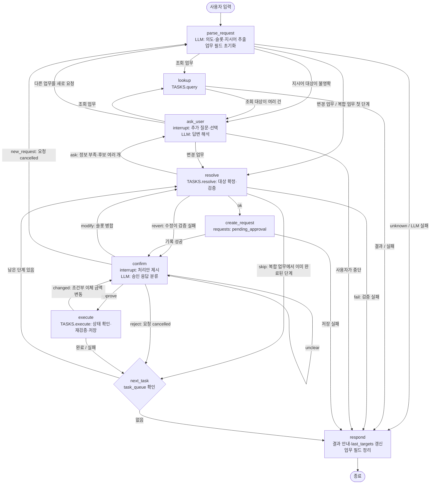

# 최종 설계 — 가상 금융 업무 에이전트

> 실제 구현(`src/`)에 맞춘 설계 자료입니다. 구현 전에 작성한 초안은 [design_draft.md](design_draft.md)(v0.3)에 그대로 보존했습니다.
> 초안에서 바뀐 내용과 이유는 [10절](#10-초안v03-대비-변경-내용과-이유)에 주제별로 정리했고, 단계별 전체 이력은 [부록](#부록-버전별-변경-이력)에 있습니다.

| 파일 | 설계 요소 |
|---|---|
| [src/graph.py](../src/graph.py) | State, LLM 출력 스키마, 노드 9개, 분기 함수, 체크포인터 |
| [src/functions.py](../src/functions.py) | 업무별 조회·검증·처리안·실행 함수, `TASKS` 레지스트리, `COMPOSITES` |
| [src/data_store.py](../src/data_store.py) | JSON 복사·읽기·저장, 초기화, 저장 실패 주입 |
| [src/main.py](../src/main.py) | 입력 반복, 승인 응답 연결, 재시작 복구 |

---

## 1. 설계 원칙

| 원칙 | 구현 |
|---|---|
| LLM은 해석만, 변경은 Python이 | LLM은 요청 분류·슬롯 추출(`ParsedRequest`), 추가 질문 답변 해석(`SlotAnswer`), 승인 응답 분류(`ApprovalReply`)만 한다. 대상 매칭·검증·데이터 변경·안내 문장은 Python이 만든다. |
| 공통 노드 + 업무 레지스트리 | 그래프는 업무와 무관한 노드 9개로 고정하고, 업무별 차이는 `functions.TASKS`에 등록한 함수로 처리한다. 업무 20개가 같은 승인·수정·거절 흐름을 공유한다. |
| 승인은 전용 노드에서 | `interrupt()`는 `ask_user`(추가 질문)와 `confirm`(승인) 노드에만 있다. Tool 안에 두면 재개할 때 Tool이 처음부터 다시 실행되기 때문이다. |
| 실행 직전 재검증 | 모든 `execute` 함수는 요청이 `pending_approval`인지 확인한 뒤 승인 때와 같은 검증을 다시 한다. |
| 한 업무의 변경은 한 번에 저장 | 잔액·거래·상태·요청 기록을 한 번의 `save_data`로 반영한다. 예외는 일괄 납부(건별 저장)뿐이다. |
| 업무 데이터의 기준은 JSON | 대화 진행 상태는 SQLite 체크포인트, 업무 결과는 JSON에 있다. 둘이 어긋나면 JSON의 요청 상태로 판단한다. |
| 재시작 후 자동 실행 금지 | 이전 승인만으로는 변경을 실행하지 않는다. 재검증한 처리안으로 새로 승인받는다. |
| 현재 사용자 고정 | `user-001`. 별명이 사용자끼리 겹치므로(`생활비`) 모든 조회는 `owner_id`로 먼저 거른다. |

---

## 2. 전체 흐름도



### 노드

| 노드 | 역할 | 중단(interrupt) | LLM |
|---|---|---|---|
| `parse_request` | 새 요청 해석. 이전 업무 필드 초기화, 기준일 갱신, 복합 업무 분해, 지시어 대상 확인 | — | `ParsedRequest` |
| `lookup` | 조회 함수 호출 | — | — |
| `resolve` | 대상 확정(이름 → ID)과 검증, 처리안(`draft`) 생성 | — | — |
| `ask_user` | 빠진 정보·후보 선택 질문, 답변을 `slots`에 병합 | ✔ | `SlotAnswer` |
| `create_request` | `requests`에 승인 대기로 기록(수정이면 같은 요청 갱신), 처리안 문장 생성 | — | — |
| `confirm` | 처리안을 보여주고 승인·거절·수정·판단 불가로 분류 | ✔ | `ApprovalReply` |
| `execute` | 요청 상태 확인 → 재검증 → 저장 | — | — |
| `next_task` | `task_queue`에서 다음 단계를 꺼냄. 앞 단계에서 확정한 대상 ID를 넘김 | — | — |
| `respond` | 결과 안내 문장 생성(템플릿), `last_targets` 갱신, 업무 필드 정리 | — | — |

---

## 3. 분기 조건

### 3-1. 조회·변경·승인·거절·실패

| 분류 | 조건 | 경로 | 데이터 변경 |
|---|---|---|---|
| **조회** | `TASKS[intent].kind == "query"` | `parse_request → lookup → respond` | 없음 |
| **변경** | `TASKS[intent].kind == "change"` 또는 `COMPOSITES`의 업무 | `parse_request → resolve → create_request → confirm` | 요청 기록(`pending_approval`)만 |
| **승인** | `ApprovalReply.decision == "approve"` | `confirm → execute → next_task → respond` | 업무 데이터 + 요청 `completed`/`partial` |
| **거절** | `decision == "reject"` 또는 추가 질문 중 `SlotAnswer.cancel` | `confirm → next_task`(남은 단계 중단) / `ask_user → respond` | 요청 `cancelled` |
| **수정** | `decision == "modify"`이고 바뀐 값이 있음 | `confirm → resolve → create_request → confirm` | 같은 요청의 `params` 갱신 |
| **전환** | 대기 중에 다른 업무를 새로 요청(`SlotAnswer.new_request`, `decision == "new_request"`) | `ask_user`·`confirm → parse_request` (입력한 문장을 새 요청으로 해석) | 진행 중이던 요청 `cancelled`, 남은 단계 중단 |
| **실패** | 검증 실패, 실행 직전 재검증 실패, 저장 실패, LLM 실패 | 아래 3-2 | 검증·재검증 실패는 요청 `failed`. 저장 실패는 파일 유지 |

### 3-2. 분기 함수

| 위치 | 조건 (`step` 등) | 다음 |
|---|---|---|
| `route_after_parse` | `intent`가 `TASKS`에 없음(unknown) 또는 `error`(LLM 실패) | `respond` |
| | `step == "ask"` (지시어 대상 불명확) | `ask_user` |
| | 조회 업무 / 변경 업무 | `lookup` / `resolve` |
| `route_after_lookup` | `step == "ask"` (조회 대상 여러 건) | `ask_user` |
| | 그 외 | `respond` |
| `route_after_resolve` | `ok` / `ask` / `revert` / `skip` | `create_request` / `ask_user` / `confirm` / `next_task` |
| | `fail` | `respond` |
| `route_after_ask` | `step == "cancel"` | `respond` |
| | `step == "switch"` (새 요청) | `parse_request` |
| | 조회 업무 / 변경 업무 | `lookup` / `resolve` |
| `route_after_create` | `ok` / 저장 실패 | `confirm` / `respond` |
| `route_after_confirm` | `approve` / `reject` / `modify` / `new_request` / `unclear` | `execute` / `next_task` / `resolve` / `parse_request` / `confirm` |
| `route_after_execute` | `step == "changed"` | `confirm` |
| | 그 외 | `next_task` |
| `route_after_next` | `task_queue`에서 다음 단계를 꺼냄(`next`) / 비어 있음 | `resolve` / `respond` |

### 3-3. 실패 처리

| 실패 | 처리 |
|---|---|
| LLM 호출·파싱 실패 | 요청 해석은 `unknown`으로 안내, 추가 질문 답변은 같은 질문 반복, 승인 응답은 `unclear`로 재질문. 데이터 변경 없음 |
| 검증 실패 (`resolve`) | 사유 안내 후 종료. 승인 전 수정이 실패한 경우는 `slots_backup`으로 되돌려 기존 처리안 재질문 |
| 재시작 후 재검증 실패 | 기존 요청을 `failed`로 기록(`fail_request`) |
| 실행 직전 재검증 실패 (`execute`) | 요청 `failed`, 데이터 변경 없음. 복합 업무면 남은 단계 중단 |
| 저장 실패 | 기존 파일 유지(임시 파일 → `os.replace`). 요청은 `pending_approval`로 남아 재시작 시 재승인 대상 |
| 일괄 납부 중 저장 실패 | 해당 건 미반영, 남은 건 미처리로 중단. 이미 저장된 납부는 유지 |

---

## 4. State

| 필드 | 설정·변경 시점 | 초기화 시점 |
|---|---|---|
| `messages` | 입력, 추가 질문·승인 질문과 답변, `respond` 안내 | 유지(SQLite) |
| `user_id` | 새 요청 입력 시 `main.py`가 전달 | — |
| `today` | `parse_request` (`datetime.now(KST)`) | 새 요청 |
| `intent` | `parse_request`, `next_task`(다음 단계) | 새 요청 |
| `slots` | `parse_request`(LLM 추출·지시어 대상 ID), `ask_user`(답변 병합·후보 선택 ID), `confirm`(수정 병합), `resolve`(수정 실패 시 복구), `next_task`(앞 단계 대상 ID 전달) | 업무 종료(`respond`) |
| `slots_backup` | `confirm`(수정 직전 값) | `create_request`, `resolve`(복구 시), 업무 종료 |
| `draft` | `resolve`(검증 통과), `execute`(조건부 이체 금액 변동) | 업무 종료 |
| `step` | `parse_request`(`ask`), `lookup`, `resolve`, `ask_user`(`cancel`/`switch`), `confirm`(`switch`), `create_request`, `execute`(`changed`/`done`), `next_task`(`next`/`done`) | 업무 종료 |
| `question`, `candidates` | `parse_request`(지시어), `lookup`, `resolve`의 `ask` | 업무 종료 |
| `plan` | `create_request`, `execute`(금액 변동) | 업무 종료 |
| `notice` | `resolve`(수정 실패), `confirm`(판단 불가), `execute`(금액 변동), 재시작 복구(`main.py`) | `confirm` 진입 후 |
| `error` | `parse_request`(LLM 실패), `lookup`·`resolve`(실패), `ask_user`(중단), `create_request`(저장 실패) | 새 요청 |
| `request_id` | `create_request` | 업무 종료, 다음 단계 시작 |
| `decision` | `confirm` | 업무 종료 |
| `result` | `lookup`, `confirm`(거절), `execute` | 새 요청 |
| `task_queue` | `parse_request`(복합 업무 분해) | `next_task`에서 하나씩 꺼냄, 앞 단계 거절·실패 시 비움 |
| `multi_step` | `parse_request`(복합 업무) | 업무 종료 |
| `parent_request_id` | `next_task`(앞 단계 요청 ID) | 업무 종료 |
| `log`, `log_shown` | `execute`·`confirm`(거절)·`resolve`(건너뜀)가 단계 결과 추가, 전환 시 취소 안내 / `ask_user`·`confirm`이 보여준 뒤 개수 갱신 | 새 요청(전환이면 취소 안내를 이어받음), 업무 종료 |
| `last_targets` | `respond`(이번 업무에서 다룬 계좌·카드·청구서·재발급 신청 ID, 마지막 요청 ID), 전환 시 취소한 요청 ID | 유지(세션 전체) |

### 예: 즉시이체를 승인 전에 수정

| 순서 | 노드 | 바뀌는 State |
|---|---|---|
| 1 | `parse_request` | `intent=transfer`, `slots={from_account:생활비, to_account:저축, amount:100000}` |
| 2 | `resolve` | `step=ok`, `draft={from_account_id:acc-001, to_account_id:acc-002, amount:100000}` |
| 3 | `create_request` | `request_id=req-001`, `plan=[즉시이체]…100,000원` |
| 4 | `confirm` ("아니, 5만 원만") | `decision=modify`, `slots_backup=기존 slots`, `slots.amount=50000` |
| 5 | `resolve` → `create_request` | `draft.amount=50000`, 같은 `req-001`의 `params` 갱신, `plan` 재생성, `slots_backup=None` |
| 6 | `confirm` ("응, 진행해") | `decision=approve` |
| 7 | `execute` | `result={status:completed, …}`, `log=[…]` |
| 8 | `respond` | `messages`에 안내 추가, `last_targets={accounts:[acc-001, acc-002], request:req-001}`, 업무 필드 정리 |

---

## 5. LLM 출력 스키마

```python
class ParsedRequest(Slots, _RequestHead):    # 필드 순서: intent, reason, referenced_slot, 슬롯...
    intent: Intent                            # 20개 업무 + unknown
    reason: str
    referenced_slot: Literal["card", "account", "from_account", "to_account", "bill", "application"] | None

class SlotAnswer(Slots, _AnswerHead):        # cancel, new_request, selected_id, 슬롯...
class ApprovalReply(Slots, _ApprovalHead):   # decision(approve·reject·modify·new_request·unclear), 슬롯...
```

`Slots` (모든 스키마 공통)

| 영역 | 필드 |
|---|---|
| 이체 | `from_account`, `to_account`, `amount`, `keep_amount`, `transfers: list[{to_account, amount}]` |
| 계좌 | `account`, `new_nickname` |
| 거래 조회 | `period`(`today`·`this_week`·`last_week`·`this_month`·`last_month`·`custom`·`all`), `start_date`, `end_date`, `min_amount`, `max_amount`, `tx_type`(`deposit`·`withdrawal`·`card_payment`) |
| 카드·재발급 | `card`, `address`(`집`·`회사`), `application` |
| 청구서 | `bill`, `bills`, `all_bills` |
| 후속 조회 | `request_kind`(`transfer`·`card`·`reissue`·`bill`·`account`), `request`, `earlier_request` |

- LLM은 이름 **문자열**만 추출한다. ID 확정은 Python이 한다.
- 상대 기간은 LLM이 `period`로 분류만 하고, 날짜 범위는 `period_range`가 `today`로 계산한다.
- 업무별로 쓰는 슬롯은 `Task.slots`에 선언하고, `_pick_slots`가 그 슬롯만 꺼내 `slots`에 넣는다.
- LLM에는 오늘 날짜와 사용자의 계좌·카드·재발급 신청·청구서 목록을 함께 준다.
- **판단 필드를 슬롯보다 앞에 둔다.** 뒤에 두면 슬롯을 모두 null로 채우는 응답이 30회 중 5회 나왔고, 앞에 두니 0회였다.

---

## 6. 업무 레지스트리와 업무별 규칙

`TASKS[intent] = Task(kind, label, slots, query | resolve·describe·execute)`

### 계좌·이체

| intent | 검증 순서 (먼저 걸리면 실패) | 실행·저장 |
|---|---|---|
| `query_accounts` | — | 계좌 목록·잔액·총액 |
| `query_transactions` | 계좌 → 날짜 형식·시작 ≤ 종료 → 금액 ≥ 0·최소 ≤ 최대 | 기간(양끝 포함, 미지정 시 전체)·금액·유형·계좌 필터, 최근순. '출금'은 카드 결제 포함, '결제'는 `card_id`가 있는 출금 |
| `transfer` | 누락 → 계좌 확정 → 금액 > 0 → 출금 ≠ 입금 → 잔액 ≥ 금액 | 잔액 2건 + 거래 2건(`merchant`=상대 계좌 별명) + 요청 |
| `conditional_transfer` | 누락 → 계좌 확정 → 남길 금액 ≥ 0 → 출금 ≠ 입금 → 이체액(잔액 − 남길 금액) > 0 | 실행 직전 이체액을 다시 계산해서 다르면 `changed`로 재승인, 0 이하면 `failed` |
| `multi_transfer` | 출금 계좌 → 목록 → 입금 계좌(하나로 맞아야 함) → 각 금액 > 0 → 중복·출금 계좌 제외 → 잔액 ≥ 총액 | 전체를 한 번에 저장. 실패 시 전부 미반영 |
| `rename_account` | 계좌 → 새 별명 누락 → 1~20자(앞뒤 공백 제거) → 현재와 다름 → 내 다른 계좌와 중복 없음(공백 무시) | `nickname` 변경. 과거 거래의 `merchant`는 유지 |

### 카드

카드 상태: `active`(사용 가능) · `locked`(일시 잠금) · `lost`(분실 정지). `CARD_ACTIONS` 표 하나로 정의한다.

| intent | 허용 → 결과 | 거부 |
|---|---|---|
| `query_cards` | 이름·ID·종류·상태 | 없는 카드 이름 |
| `report_lost` | `active`·`locked` → `lost` | `lost` (복합 업무에서는 건너뜀) |
| `lock_card` | `active` → `locked` | `locked`, `lost` |
| `unlock_card` | `locked` → `active` | `active`, `lost`(재발급 안내) |
| `reissue_card` | `lost` 카드만. 신청 `received` 생성, 카드는 `lost` 유지 | 분실 정지 아님, 취소되지 않은 기존 신청 있음(안내), 배송지 없으면 질문 |
| `query_reissue` | 1건이면 바로, 여러 건이면 최신순 선택 | 기록 없음 |
| `modify_reissue` / `cancel_reissue` | `received`만 배송지 변경 / 취소 | `in_production`·`shipping`·`delivered`·`cancelled`(사유 안내), 같은 배송지 |
| `lost_and_reissue` (복합) | `report_lost` → `reissue_card`, 각각 승인 | 1단계 거절·실패 시 2단계 진행 안 함. 2단계 실패·취소 시 1단계 유지 |

재발급 신청 상태: `received` → `in_production` → `shipping` → `delivered`, 또는 `received` → `cancelled`

### 청구서

| intent | 검증 | 실행·저장 |
|---|---|---|
| `query_bills` | — | 미납 납기일순, 합계, 기한 지남 표시(연체료 없음) |
| `pay_bill` | 청구서 확정(부분 일치 1건이면 사용) → 미납 → 출금 계좌 → 잔액 | 잔액 + 출금 거래(`merchant`=청구서 이름) + 청구서 `paid` + 요청 |
| `pay_bills_batch` | 출금 계좌 → 대상(목록 또는 전부) → 이미 납부 제외 후 1건 이상. 총액 > 잔액이어도 승인 가능(처리안에 안내) | 납기일순 건별 저장. 잔액 부족은 실패(미납 유지)로 두고 계속, 저장 실패 시 중단. 건별 저장에 진행 기록(`result.items`) 포함 |

### 공통

| intent / 기능 | 규칙 |
|---|---|
| `query_request_status` | 요청 ID 지정 > 대화 중 마지막 요청(종류가 맞을 때) > 종류가 맞는 요청 1건 > 최근 5건에서 선택. `earlier_request`면 마지막 요청과 그 이후는 제외 |
| 지시어 (`referenced_slot`) | `last_targets`의 해당 종류가 1개면 사용, 여러 개면 그중 선택, 없으면 전체에서 확인 |
| 후보 선택 | 모든 후보는 `{"id", "label"}` 형식. 답변은 `SlotAnswer.selected_id`로 받고 후보에 있는 ID만 인정 |
| 이름 매칭 | 계좌는 공백·'계좌/통장', 카드는 공백·'카드'를 무시하고 비교. 정확히 하나면 확정, 부분 일치는 확인 질문 |

---

## 7. 데이터 설계

| 대상 | 추가·결정 사항 |
|---|---|
| `requests` | `request_id`, `owner_id`, `type`(intent), `params`(draft), `status`, `parent_request_id`, `created_at`, `updated_at`, `result{message, transaction_ids?, items?, …}` |
| 요청 상태 | `pending_approval` → `completed` · `partial`(일괄 납부 일부) · `cancelled` · `failed` |
| `reissue_applications` | `application_id`, `owner_id`, `card_id`, `address_id`, `status`, `request_id`, `created_at`, `updated_at` |
| `cards.status` | `locked`, `lost` 추가 |
| `bills` | `status: paid`, `paid_at`, `paid_account_id`, `transaction_id` |
| 이체 거래 | 출금·입금 1건씩, `card_id=null`, `merchant`=이체 당시 상대 계좌 별명 |
| 납부 거래 | 출금 1건, `card_id=null`, `merchant`=청구서 이름 |
| ID 생성 | 같은 접두어의 최대 번호 + 1 (`tx-021`, `req-001`, `rei-001`) |

### 파일

| 파일 | 역할 |
|---|---|
| `data/initial_data.json` | 원본. 수정하지 않음 |
| `data/bank_data.json` | 작업용. 없으면 원본에서 복사 |
| `data/test_seed.json` | 테스트 시드. `초기화 테스트`에서 ID 기준으로 병합(같은 ID 교체, 새 ID 추가). 여행 카드 제작 중, 교통 카드 배송 중·취소 이력 |
| `data/checkpoints.sqlite` | LangGraph 체크포인트. `thread_id = user-001` |

- 저장: 임시 파일에 쓰고 `os.replace`로 교체한다. 어떤 실패든 `SaveError`로 바꿔서 알린다.
- 초기화: 작업용 JSON과 체크포인트를 **함께** 지운다(하나만 지우면 대화와 데이터가 어긋남).
- 저장 실패 주입: `FAIL_SAVE_AT=n[,m]`이면 프로세스 안에서 n번째 저장을 실패시킨다.

---

## 8. 재시작·장애 복구

`main.py`는 시작할 때 `recover(startup=True)`를 실행한다.

| 상태 | 판단 기준 | 처리 |
|---|---|---|
| 대화와 연결되지 않은 대기 요청 | JSON에 `pending_approval`인데 현재 체크포인트의 요청이 아님 | 안내하고 `failed`(저장된 건이 있으면 `partial`)로 정리. 실행하지 않음 |
| 중단 없음 | `state.next`가 비어 있음 | 입력 대기 |
| 추가 질문 대기 | `ask_user` interrupt | 같은 질문을 다시 표시 |
| 이미 JSON에 반영됨 | 요청이 `pending_approval`이 아님 | `as_node="execute"`로 결과만 넣고 이어서 안내(중복 실행 없음). 남은 단계가 있으면 계속 |
| 승인 대기·승인 후 실행 전 | 요청이 `pending_approval` | `as_node="parse_request"`로 되감아 `resolve`부터 재검증 → 처리안 재표시 → **새 승인**. 재검증 실패면 요청 `failed` |
| 일괄 납부 도중 | 위와 같음 (진행 기록 있음) | 재검증에서 이미 낸 청구서가 빠져 남은 건만 재승인. 결과는 이전 완료 건과 합산 |
| 복합 업무 도중 | `task_queue`, `log` 남음 | 완료된 단계 결과를 다시 안내하고 남은 단계를 재승인 |
| 요청 기록 전 단계 | 요청 없음 | 데이터 변경이 없으므로 그대로 이어서 실행 |

대화 중 노드에서 예외가 나면(interrupt 없이 멈춤) 다음 입력 전에 같은 규칙으로 정리한다(`recover(startup=False)`).

---

## 9. 검증

`uv run pytest` 128개(가짜 LLM으로 그래프 흐름·재시작 복구 포함), `RUN_LLM_TESTS=1 uv run pytest -m llm` 16개. 실행 결과와 직접 고른 실패 상황은 [README 5절](../README.md#5-동작-확인-결과)에 정리했다.

---

## 10. 초안(v0.3) 대비 변경 내용과 이유

초안의 뼈대(공통 노드 9개, `TASKS` 레지스트리, `task_queue`, SQLite 복구, 실행 직전 재검증)는 그대로 유지했다. 바뀐 부분은 구현하면서 초안으로는 동작하지 않거나 명세를 충족하지 못한다는 것을 확인한 곳이다.

### 10-1. 흐름

| 초안 | 최종 | 이유 |
|---|---|---|
| `ask_user → parse_request` | `ask_user → resolve`(변경) / `lookup`(조회) / `respond`(중단) | 답변을 새 요청으로 해석하면 앞서 받은 값이 초기화된다. 사용자가 중단하면 같은 질문이 반복되지 않게 끝낸다. |
| 수정(`modify`)이 검증에 실패하면 실패로 종료 | `slots_backup`으로 되돌리고 `confirm`에서 기존 처리안을 다시 질문 (`revert`) | "1억으로 바꿔줘" 같은 잘못된 수정 하나 때문에 진행 중이던 요청 전체가 실패하면 안 된다. |
| 조회는 `lookup → respond`만 | `lookup → ask_user → lookup` | 재발급 신청이 여러 건이면 목록에서 선택받아야 한다(명세). |
| 지시어는 `resolve`에서 처리 | `parse_request`에서 대상을 확인하고 불명확하면 바로 `ask_user` | 업무별 `resolve`마다 지시어 처리를 넣지 않고 한 곳에서 처리한다. |
| 복합 업무 단계 실패 규칙 없음 | 이미 완료된 단계는 건너뜀(`skip`), 앞 단계 거절·실패 시 남은 단계 중단(`_stop_queue`) | 이미 정지된 카드 때문에 재발급 요청까지 실패하면 안 되고, 정지가 안 된 카드는 재발급할 수 없다. |
| 복합 업무 결과는 마지막에 한꺼번에 안내 | 앞 단계 결과를 다음 질문 앞에 먼저 표시(`log`, `log_shown`) | 정지됐는지 모르는 채 배송지 질문을 받는 흐름이 어색했다. 재시작 후에도 완료된 단계를 다시 보여준다. |

### 10-2. State

| 초안 | 최종 | 이유 |
|---|---|---|
| `draft` 하나에 추출 값과 ID를 함께 둠 | `slots`(LLM 추출 값) / `draft`(ID로 확정한 처리안) 분리 | 수정·후보 선택 때 원래 표현을 유지하고, 무엇이 확정됐는지 구분한다. |
| `missing` 필드 | 삭제. 대신 `step`, `question`, `notice`, `slots_backup` 추가 | 분기 조건을 `step` 하나로 판단하고, 질문·안내 문장을 노드 사이에 전달한다. |
| — | `multi_step`, `parent_request_id`, `log`, `log_shown` 추가 | 복합 업무의 단계 표시, 요청 연결, 단계별 결과 안내 |
| `last_targets: {account, card, …}` (대상 하나씩) | 종류별 ID **목록** + 마지막 요청 | 목록 조회 뒤 "그 카드"처럼 후보가 여러 개인 경우를 구분해야 한다. |

### 10-3. LLM 스키마

| 초안 | 최종 | 이유 |
|---|---|---|
| `refers_to_previous: bool` | `referenced_slot`(가리키는 슬롯 이름), 해당 슬롯은 null | 어느 슬롯을 가리키는지 알아야 채울 수 있다. 이름을 LLM이 추측하면 확인 없이 잘못된 대상을 고를 수 있다. |
| `ApprovalReply.changes: ParsedRequest` | `ApprovalReply`가 `Slots`를 상속해 바뀐 값만 채움. 추가 질문용 `SlotAnswer` 신설 | 세 스키마가 같은 슬롯 정의를 공유하고, 업무를 추가할 때 한 곳만 고친다. |
| 필드 순서를 따로 정하지 않음 | 판단 필드(`intent`·`decision`·`cancel`)를 맨 앞에 배치 | 슬롯이 늘어나자 슬롯을 모두 null로 채우는 응답이 5/30회 나왔고, 앞에 두니 0/30회였다. |
| `period`: 5종 | `today`, `last_week` 추가(7종) | 자주 쓰는 상대 기간을 LLM이 날짜를 계산하지 않고 처리하게 한다. |
| `address_label`, `application_ref` | `address`(`집`/`회사`), `application`; 후속 조회용 `request_kind`, `request`, `earlier_request` 추가 | "아까 이체"는 업무 종류로, "그 전에 한 이체"는 마지막 요청 제외로 찾는다. |

### 10-4. 업무 규칙·데이터

| 초안 | 최종 | 이유 |
|---|---|---|
| 별명 정확 일치 | 공백·'계좌/통장'·'카드'를 무시하고 비교, 부분 일치는 확인 질문 | "여행자금", "생활비카드" 같은 표현. 확신할 수 없는 대상은 다시 확인한다(명세). |
| 모든 대상 이름에 같은 규칙 | 청구서는 부분 일치 1건이면 사용, 여러 계좌 이체의 입금 계좌는 하나로 맞아야 함 | 처리안에 이름·금액이 모두 표시되어 승인 단계에서 확인된다. 목록 중 한 항목만 되묻는 대화는 복잡하다. |
| 일괄 납부 중단 시 "남은 건은 **새 요청**으로 재승인" | **같은 요청**의 `params`를 남은 건으로 갱신해 재승인하고, 결과에 이전 완료 건을 합산 | 건별 저장에 진행 기록을 함께 남기고, 재검증에서 이미 낸 건이 자연스럽게 빠진다. 결과를 한 요청에서 볼 수 있다. |
| 재시작 복구는 체크포인트 상태만 확인 | 대화와 연결되지 않은 대기 요청을 찾아 정리(`close_orphan_requests`) | 일괄 납부의 최종 기록 저장이 실패하면 그래프는 끝났는데 요청만 대기로 남는다. |
| 결과 안내는 LLM이 생성 | 템플릿 문장 | 금액·잔액을 잘못 말할 위험을 없애고 테스트를 쉽게 한다. |
| 질문·승인 대기 중 입력은 모두 그 질문의 답으로 해석 | 다른 업무 요청이면 진행 중이던 요청을 취소하고 새 요청으로 해석(`new_request`, `ask_user`·`confirm → parse_request`) | 최종 점검에서 발견. 후보 선택 질문 중 새 요청을 입력하면 같은 질문만 반복됐고, 대기 상태가 체크포인트에 남아 재시작해도 빠져나올 수 없었다. |
| 실행 함수를 Tool로 제공(원래 파일 주석) | 그래프 노드가 `TASKS`를 직접 호출 | 검증 → 승인 → 실행 순서를 그래프가 보장한다. LLM이 실행 시점을 정하지 않는다. |
| 테스트 시드: `card-002` 제작 중 | `card-002` 제작 중 + `card-005`(교통 카드) 배송 중·취소 이력 | 배송 중 제한과, 취소된 신청이 후보에서 빠지는 것까지 확인한다. |

---

## 부록: 버전별 변경 이력

| 버전 | 단계 | 변경 내용 | 이유 |
|---|---|---|---|
| v0.1 | 설계 | 최초 초안 (계좌 조회 + 즉시이체) | — |
| v0.2 | 설계 | 라우터를 LLM structured output 단독으로 확정 | 다양한 자연어 표현을 규칙으로 다 덮기 어려움. 검증은 Python이 맡아 안전성 확보 |
| v0.2 | 설계 | 이체 거래 `merchant`에 상대 계좌 별명 기록 | 거래 내역에서 이체 상대 확인 |
| v0.2 | 설계 | 기준일을 실제 오늘 날짜로, `today` 필드 추가 | 실제 앱처럼 동작 |
| v0.2 | 설계 | `SqliteSaver`와 재시작·복구 규칙 추가 | 재시작 복구 요구사항 |
| v0.2 | 설계 | 실행 시 요청 상태 확인, 요청 상태 동시 저장 | SQLite와 JSON이 어긋나도 중복 실행 방지 |
| v0.3 | 설계 | 전체 업무 설계, 공통 노드 9개 + `TASKS`, `task_queue`, `last_targets`, `execute → confirm`, `period` 분류, 테스트 시드·저장 실패 주입 | 업무별 노드로는 그래프가 커지고 승인 흐름이 중복됨 |
| v0.4 | 1단계 | `ask_user → resolve`, 중단 시 종료, 수정 실패 복구(`slots_backup`), `slots`/`draft` 분리, `step`·`question`·`notice`, 템플릿 안내, 별명 정규화, Tool 대신 직접 호출 | 10-1, 10-2, 10-4 참고 |
| v0.5 | 2단계 | 공통 `Slots` 상속 + `Task.slots`, 후보 형식 `{id, label}`, `CARD_ACTIONS` 표, 카드 조회는 되묻지 않음, 카드 ID 지정 | 업무를 추가해도 그래프 코드를 고치지 않음 |
| v0.6 | 3단계 | 복합 업무 `already`·`_stop_queue`·`log`·`parent_request_id`, `lookup → ask_user`, 취소된 신청 후보 제외, 배송지 `집`/`회사`, 테스트 시드 확장 | 10-1, 10-4 참고 |
| v0.7 | 4단계 | 일괄 납부 건별 저장 + 진행 기록, 재실행 시 결과 합산, 완료/실패(미납 유지)/미처리, 청구서 부분 일치, 계좌 잔액 안내, 기한 지남 표시 | 도중 종료돼도 남은 건만 재승인 |
| v0.8 | 5단계 | 판단 필드 앞 배치(5/30 → 0/30), 기간 7종, 출금·결제 구분, `changed` 재승인, `_apply_transfer` 공유, 여러 계좌 이체 매칭 규칙, 별명 중복 규칙 | 10-3, 10-4 참고 |
| v0.9 | 6단계 | `referenced_slot`, 종류별 `last_targets`, 지시어 확인 규칙, 후속 조회 우선순위·`earlier_request`, 연결 없는 대기 요청 정리 | 10-2, 10-3, 10-4 참고 |
| 최종 | 정리 | 테스트를 `tests/`(pytest)로 이동, 가짜 LLM·임시 폴더 격리, 체크포인트 경로를 실행 시점에 읽도록 변경 | 실제 데이터를 건드리지 않고 흐름·복구를 반복 확인 |
| 최종 | 점검 | 대기 중 새 요청 전환(`new_request`), 조회 결과는 앞선 안내가 있어도 항상 표시 | 전체 시나리오 점검에서 발견한 결함 수정 |
